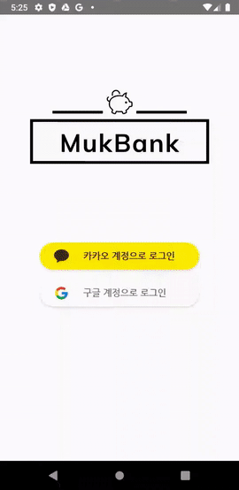
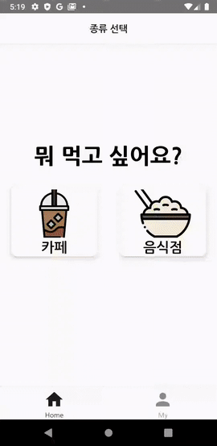
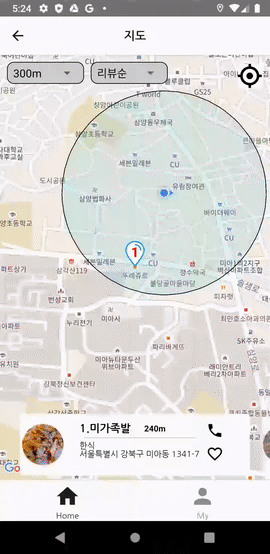
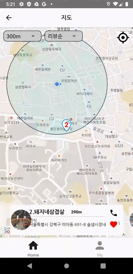
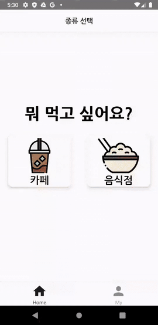

# MukBank-client

> 선호하지 않은 음식을 체크하고, 거리별 추천별 위치 기반으로 맛집을 추천받자!

### 프로젝트 소개 페이지

[notion.so/MukBank](https://www.notion.so/3-ToNaEat-MukBank-a87f0fa125d14655b4040433da09da56)

## 주요기능

- 안전하고 빠른 소셜 로그인
- 싫어하는 음식 기반 필터링 후 추천
- 내 위치 기반 주변 카페 음식점 추천(리뷰순, 거리순)
- 좋아하는 음식점, 카페 북마크 표시 후 확인, 삭제 가능
    

### 로그인, 로그아웃, 마이페이지

먹뱅크는 소셜로그인을 지원합니다. 로그인이 성공적으로 등록되면 서버로부터 토큰이 발급되며 토큰이 만료 될 때까지 앱에서 자동적으로 로그인 됩니다. 로그인 후 자신의 정보는 마이페이지에서 확인 할 수 있으며 로그아웃 누를 시 토큰이 삭제되어 다시 로그인 스크린으로 돌아가게 됩니다.

### `싫어하는 음식 선택`

음식점을 선택하게 되면 싫어하는 음식 종류를 선택 해 필터링 할 수 있습니다. 만약 모든 음식 종류를 선택하게 되면 다음 스크린으로 넘어가지 못하게 오버레이 설정하였습니다.

### `슬라이드,상세페이지`

지도에서는 내 주변의 거리순, 리뷰순으로 가게(음식점, 카페)를 차례대로 슬라이드(캐러셀)로 나태내 줍니다. 슬라이드를 누르게 되면 누른 가게의 상세정보(사진, 설명, 전화번호, 주소, 영업시간, 부대시설, 메뉴)를 볼 수 있습니다.

### `길찾기`

마커를 누를 시 내 위치에서 도착지점까지 경로를 보여줍니다.

### `피커`

상단의 피커에서는 가게를 내 주변의 거리(100~500m)순 또는 리뷰순으로 볼 지 선택 할 수 있습니다.

### `좋아요 리스트`

지도의 슬라이드에서 좋아요(북마크 기능)을 누를 시 마이페이지의 좋아요 리스트에서 내가 좋아요를 누른 가게를 볼 수 있습니다. 삭제를 할 시 리스트에서 삭제되며 지도에서도 좋아요가 사라집니다.
